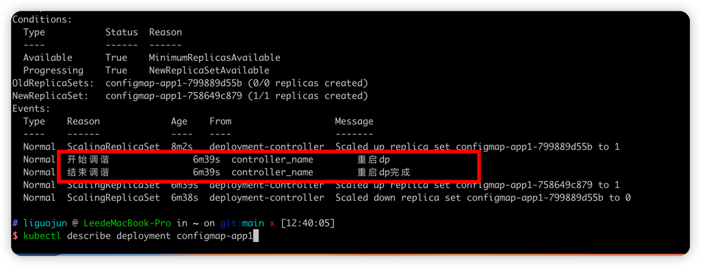
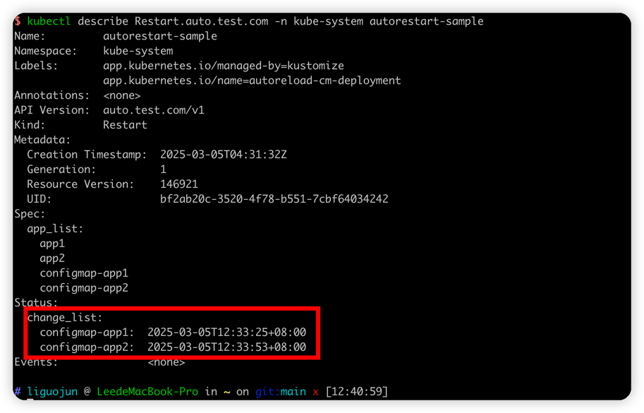

# autoreload-cm-deployment
控制器基于kubebuilder开发，实现的功能是编辑configmap，自动重启对应的deployment服务，用于加载新的configmap文件
同时更新status和生成对应的events



## 安装步骤
```
make docker-build docker-push IMG=image_url
make build-installer IMG=image_url
kubectl apply -f dist/install.yaml
```